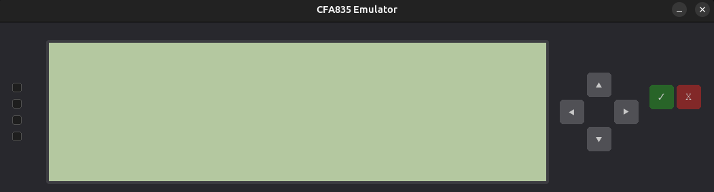

# CrystalfontzEmulator

A Python emulator for the Crystalfontz CFA835 244x68 grayscale LCD module. Exposes a virtual serial port (PTY) with the same packet protocol as real hardware, so client software can connect as if talking to an actual device.

Features: 244x68 pixel display, 4 bicolor LEDs, 6-button keypad, text and graphics mode, image streaming.

